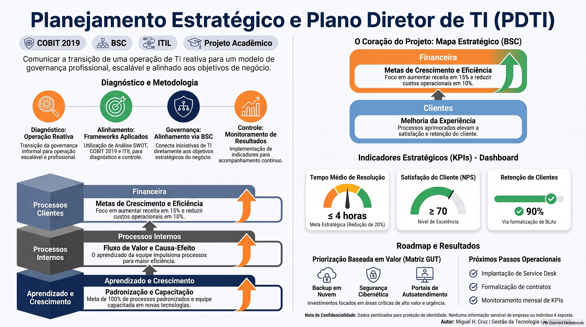

  

Alinhamento estratégico entre TI e negócio, estruturação de portfólio e roadmap tecnológico para evolução da maturidade de governança.

#### **Natureza:** Acadêmico / Empresarial Real

---

## Visão Geral

Este projeto consistiu na elaboração do Plano Diretor de Tecnologia da Informação (PDTI) para uma empresa real de serviços de TI. O trabalho focou no alinhamento estratégico entre as metas corporativas e as iniciativas de tecnologia, utilizando o Balanced Scorecard (BSC) para conectar objetivos de negócio a ações de TI, estruturar o portfólio de serviços e definir indicadores de desempenho (KPIs) para um horizonte de 12 a 24 meses.

## Contexto e Problema

A organização possuía alta capacidade técnica de execução, mas operava com processos de governança empíricos. As iniciativas tecnológicas eram predominantemente reativas, focadas na resolução de incidentes operacionais, sem uma visão clara de como a tecnologia poderia impulsionar o crescimento da receita, a retenção de clientes e a eficiência dos processos internos. Essa desconexão limitava a escalabilidade do negócio e a previsibilidade dos investimentos.

## Objetivos

- Alinhar os objetivos estratégicos de TI às metas corporativas (Perspectivas Financeira, Clientes, Processos Internos e Aprendizado).
- Estruturar o portfólio de serviços e projetos de TI com base no valor gerado para o negócio.
- Definir indicadores de desempenho (KPIs) e metas mensuráveis para a governança de TI.
- Elaborar um roadmap tecnológico para a transição de uma operação empírica para um modelo de serviços estruturado (baseado em ITIL e COBIT).

## Escopo
**Inclusões:** Diagnóstico estratégico, análise SWOT, mapeamento BSC, definição de portfólio de TI, estruturação de KPIs e planejamento de roadmap.
**Exclusões:** Implementação técnica das soluções, aquisição de hardware e expansão física da infraestrutura.
**Limites:** Projeto acadêmico com prazo definido. As projeções financeiras e de eficiência operacional representam metas estabelecidas no plano, e não resultados históricos consolidados.

## Papel e Responsabilidades

Atuação na condução do diagnóstico estratégico, elaboração da análise SWOT, construção da matriz de alinhamento BSC (conectando perspectivas de negócio a iniciativas de TI) e definição dos KPIs e do portfólio de serviços.

## Metodologia e Abordagem

O projeto foi conduzido em fases estruturadas:

1. **Entendimento do Negócio:** Mapeamento da Missão, Visão, Valores e objetivos corporativos macro.
2. **Alinhamento Estratégico (BSC):** Desdobramento dos objetivos corporativos em quatro perspectivas, conectando-os a objetivos e iniciativas específicas de TI.
3. **Análise de Cenário:** Realização de análise SWOT para identificar forças, fraquezas, oportunidades e ameaças do ambiente de TI atual.
4. **Estruturação do Portfólio:** Categorização dos serviços e projetos de TI com base em sua contribuição estratégica e priorização (GUT).
5. **Definição de KPIs e Roadmap:** Estabelecimento de metas mensuráveis e cronograma de implementação das iniciativas prioritárias.
## Frameworks e Boas Práticas

- **Balanced Scorecard (BSC):** Utilizado como ferramenta central para traduzir a estratégia do negócio em objetivos acionáveis de TI, estabelecendo relações de causa e efeito.
- **COBIT 5/2019:** Aplicado para garantir que o portfólio e os processos de TI estivessem alinhados aos objetivos de governança e gestão de riscos.
- **ITIL:** Utilizado como referência para a estruturação do portfólio de serviços e definição de métricas de nível de serviço.
- **SWOT:** Aplicado para o diagnóstico do ambiente interno e externo de TI.

## Tecnologias e Ferramentas

- **Modelagem e Gestão:** Ferramentas de modelagem de processos, planilhas para matriz BSC e projeções estratégicas.
- **Diagramação:** Draw.io (para topologias e fluxos estratégicos).

## Solução e Arquitetura

A solução entregue foi um modelo de planejamento estratégico que rompeu com a visão puramente operacional da TI. A arquitetura do plano estabeleceu relações de causa e efeito claras: por exemplo, a *Capacitação da equipe (Aprendizado)* leva à *Melhoria dos processos internos*, que resulta em *Maior satisfação do cliente* e, finalmente, no *Aumento da receita (Financeira)*. O portfólio de TI foi desenhado para suportar diretamente essas cadeias de valor.

## Evidências e Entregáveis

- **Matriz de Alinhamento Estratégico (BSC):** Tabela detalhada conectando objetivos corporativos a iniciativas de TI (ex: Reduzir custos operacionais → Automação de processos e Backup em nuvem).
- **Análise SWOT de TI:** Diagnóstico estratégico identificando a equipe qualificada como força, e a ausência de SLAs formais como fraqueza crítica.
- **Portfólio de Serviços de TI:** Catálogo de serviços estruturado (Suporte, Infraestrutura, Projetos, Consultoria) com priorização.
- **Dashboard de KPIs:** Definição de indicadores estratégicos (ex: Tempo Médio de Resolução, NPS, Taxa de Retenção de Clientes, Taxa de Capacitação).
- **Roadmap Tecnológico:** Cronograma de iniciativas para os próximos 12 a 24 meses.

*[Espaço reservado para inserção de imagens da Matriz BSC, Gráfico do Portfólio de TI ou Dashboard de KPIs sanitizados]*

  

## Resultados e Validação

- Estabelecimento claro da relação de causa e efeito entre investimentos em TI e resultados de negócio.
- Definição de metas estratégicas para o PDTI, incluindo **projeções** de redução de 20% no tempo de resposta ao cliente (via implementação de Service Desk) e aumento de 20% na retenção de contratos (via formalização de SLAs).
- Aprovação do plano pela gestão como o guia mestre para a transição da maturidade organizacional.
## Aprendizados e Limitações
- **Aprendizado:** O uso do BSC foi fundamental para "vender" a governança de TI para a alta gestão, pois traduziu termos técnicos (ex: virtualização, backups) em linguagem de negócio (ex: redução de custos, continuidade do serviço).
- **Limitação:** O sucesso do PDTI depende intrinsecamente da disciplina na execução das iniciativas e no monitoramento contínuo dos KPIs, o que exige uma mudança cultural na organização que vai além da entrega do plano.

---

## 📂 Documentação, Evidências e Recursos

- [Relatório Planejamento Estrategico](docs/planejestrategico.pdf)
- [Relatório Executivo do PDTI](docs/pdti.pdf)
- [Video de Apresentação](https://drive.google.com/file/d/1EsgV0PF4m60OPkClJ20KyyatZ058_CDt/view?usp=sharing)

- [Link para a Matriz de Alinhamento BSC] (docs/ .pdf)
- [Link para a Análise SWOT e Portfólio de TI] (docs/ .pdf)
---

## Contato

---

## 🧭 Navegação do Portfólio

[⬅️ Voltar ao Perfil Principal](https://github.com/mighcruz)
[📂 Voltar ao Hub Central de Projetos](https://github.com/mighcruz/portfolio-ti)

---

###### 🔒 Nota de Confidencialidade

###### *Tratando-se de um projeto desenvolvido em ambiente de simulação corporativa e laboratório de testes, quaisquer topologias de rede, endereços IP, credenciais de acesso ou configurações específicas mencionadas na documentação original foram omitidas ou sanitizadas neste repositório, preservando as boas práticas de segurança da informação.*
